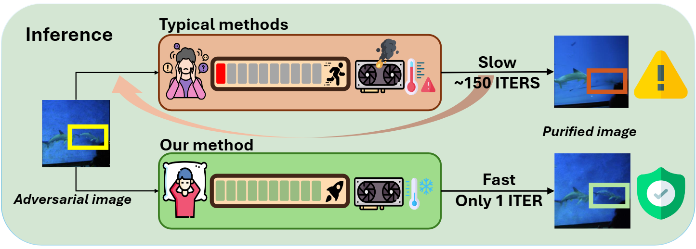
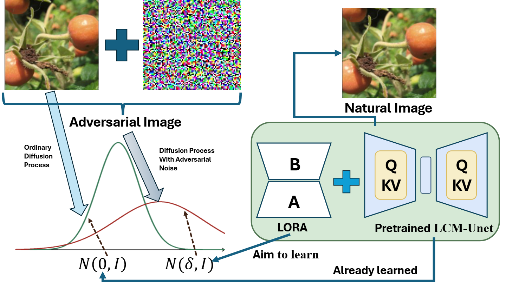
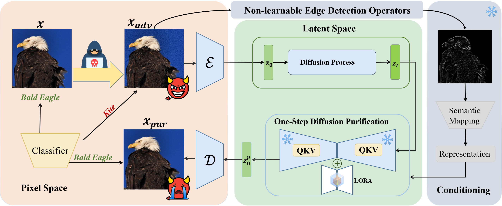

# Instant Adversarial Purification with Adversarial Consistency Distillation (CVPR2025)
## [Paper (ArXiv)](https://arxiv.org/abs/2408.17064) 

Official Implementation for CVPR 2025 paper Instant Adversarial Purification with Adversarial Consistency Distillation.




**Stable Diffusion:** Our model is developed by distilling Stable Diffusion v1.5 with special LCM LoRA objective.
## Training objective


---
## Train
Once you have prepared the data, you can train the model using the following command. 

```
bash train_lora.sh
```
---
## Evaluation
Evaluation code for ImageNet is provided.

```
bash test.sh
```
---
## Purification pipeline



## Citation
Consider cite us if you find our paper is useful in your research :).
```
@inproceedings{lei2025instant,
               title={Instant adversarial purification with adversarial consistency distillation},
               author={Lei, Chun Tong and Yam, Hon Ming and Guo, Zhongliang and Qian, Yifei and Lau, Chun Pong},
               year={2025},
               booktitle={Proceedings of the IEEE/CVF conference on computer vision and pattern recognition}
}
```
